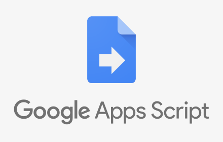

# GAS Snippets

Sharing some reusable [Google Apps Script](https://developers.google.com/apps-script/) snippets with the world.



## Dev

### Compiling JS files

You can build GAS-comptatible JavaScript from typescript files locally, using by running:

```bash
node build {snippet dir}`.
```

This command will only work if the project provided has a `src/` directory, and (at the moment), the src directory must not contain subdirectories.
